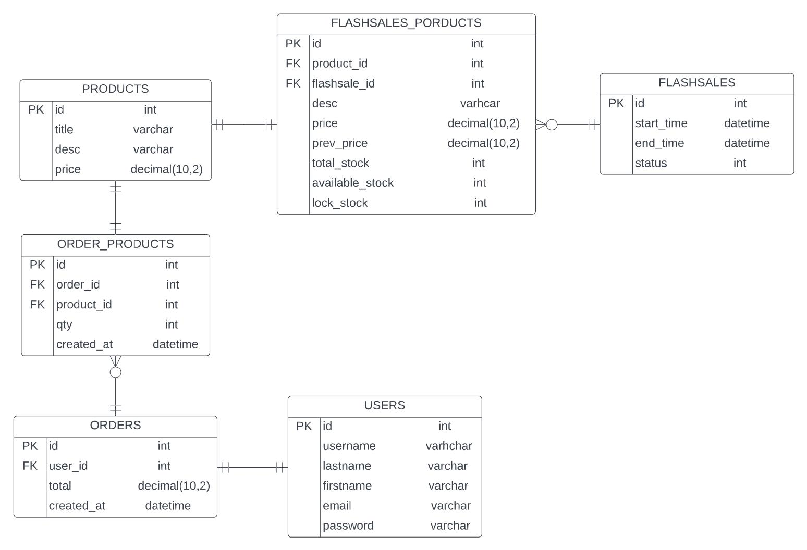
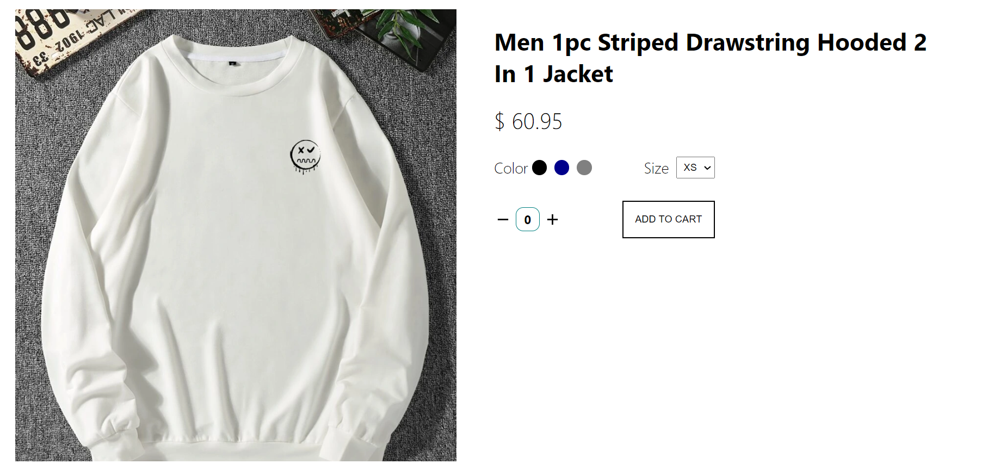
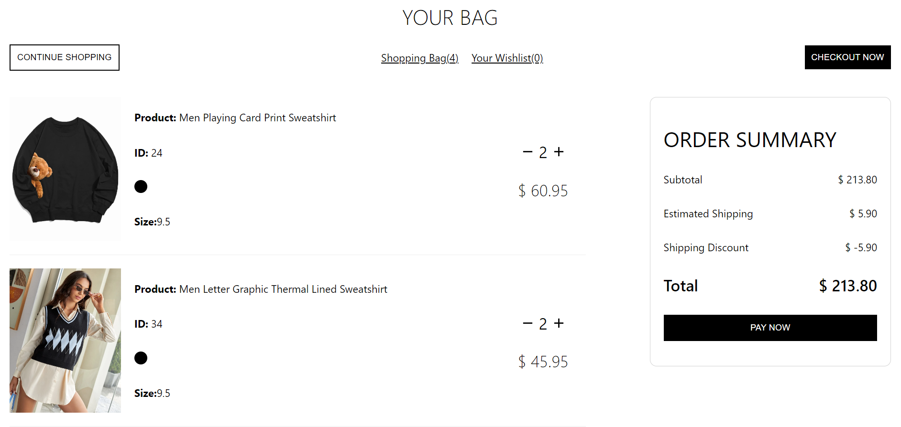

# General

This project is a full-stack web app featured with flash sale that has high concurrency and high availability powered by Java Spring Boot.

### Scenario

The scenario involves a retailer offering products with limited time and stock to allow customers to buy them on a good budget.

It comes with the following **characteristics**:

- Large number of users come to the system at the same time, causing a spike in traffic.
- Number of ordering request is much larger than inventory size.

### Challenges

- **Avoid inventory from being oversold or undersold.**
- **Provide high throughput to handle high traffic and high concurrency.** There will be many concurrent read and write to the limited inventory records. It can be considered challenging since Databases have limited QPS. 
- **Other service works normally**. Ensure that the system will not be hung up under high concurrent requests and cannot affect other services.

# Technology Stack

- The front-end web application is built with `ReactJS` framework and `NodeJS`.
- The server is a Linux instance running the `Spring Boot` web development framework.
- `MySQL` database is constructed and connected with back-end server using `Hibernate` as JPA provider and is interacted by calling the functions that match the CRUD operations.
- `Redis` is utilized as the cache middleware and `Lua Scripting` to reduce the query frequency of MySQL database, prevent overselling, and avoid cache blanks at the beginning of the event.
- `RocketMQ` is utilized as the message queue to implement peak-load shifting in processing large traffic.

# API Documentation

The REST web services have been documented using `Swagger`, visit it via [https://flashsales-api.herokuapp.com/swagger-ui/](https://flashsales-api.herokuapp.com/swagger-ui/)

# ER Diagram

# UI Features

Visit it via [https://itsflashsales.netlify.app/](https://itsflashsales.netlify.app/)

### Countdown Timer for Deals

The flash-sale activity with its products will disappear once its corresponding countdown timer come to the end.

### Product Details Display

### Cart and Order Summary

